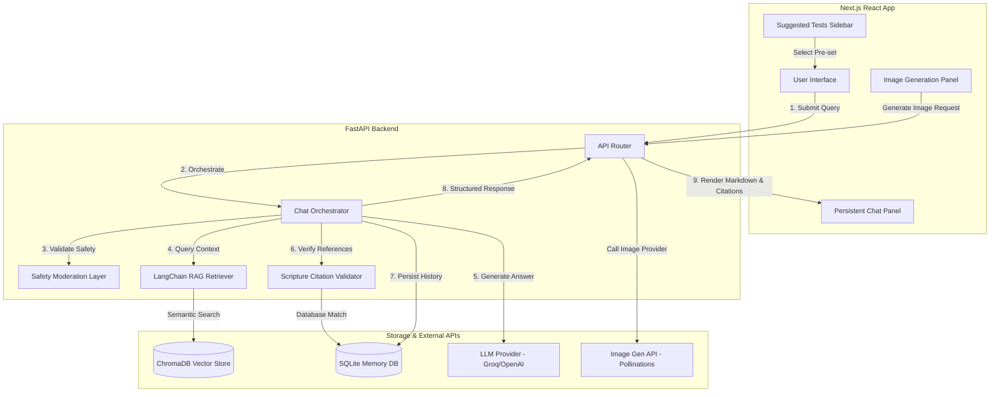

# 🌿 FaithAssist AI

FaithAssist AI is a premium, production-ready AI Assistant designed to provide grounded, scripture-verified answers to theological questions. It combines a minimalist, glassmorphic React/Next.js frontend with a robust FastAPI backend orchestrator featuring RAG, safety moderation, citation validation, and Christian-themed image generation.

---

## 🚀 Key Features

*   **Verified Scripture RAG Pipeline**: Combines semantic embeddings with keyword fallbacks to retrieve and rank context from biblical texts and theological resources.
*   **Active Citation Validation**: Prevents hallucinated or misquoted scriptures by extracting, verifying, and matching citations against a structured database.
*   **Persistent Tab Navigation**: Visibility-based tab switching preserves chat history, input state, scroll position, and active UI states.
*   **Suggested Tests Suite**: Integrated directly in the sidebar for immediate selection of questions spanning Bible trivia, devotional content, denominations, fake/hallucination tests, and safety tests.
*   **Full LLM Output Orchestration**: Intelligently toggles between un-truncated, detailed LLM responses (when API key is active) and robust single-sentence fallback responses.
*   **Christian-themed Image Generation**: Built-in panel configured with default prompt presets ("Create a peaceful Christian wallpaper with a cross at sunrise") using Pollinations or DALL-E.

---

## 📐 System Architecture

The following diagram illustrates the data flow from the user query through safety checks, retrieval, generation, citation verification, and frontend display:



---

## 🛠️ Project Flow

1.  **Safety Verification**: The backend parses incoming prompts to intercept and block requests for fabricated scriptures, hateful sermons, violent religious propaganda, and jailbreaks.
2.  **Context Retrieval**: If safe, the RAG engine queries the database (via semantic search or keyword fallback) to retrieve relevant Bible verses and supporting theology chunks.
3.  **Context-Guided Generation**: The orchestrator inserts the retrieved text into the LLM system prompt, instructing it to construct a humble, biblically grounded answer.
4.  **Citation Checking & Verification**: 
    *   The backend scans the generated answer for scripture references (e.g., *Matthew 5:9*).
    *   It matches them against the verified SQLite scripture database.
    *   If matched, it appends a `Verified Scripture` badge with confidence scores.
    *   If a citation is hallucinated or unverified, it repairs the output or appends: *"Interpretation may vary / I could not confidently verify this verse."*
5.  **Render State Toggling**: The frontend renders the response using beautiful custom cards: **Summary** (full raw text or fallback), **Key Scripture**, **Grounded Sources** accordion, and **AI Grounding Status** badges.

---

## 📂 Repository Structure

```text
CRISbot/
├── backend/
│   ├── app/
│   │   ├── models/            # Pydantic schemas (messages, citations)
│   │   ├── services/          # ChatOrchestrator, citation validator, safety models
│   │   ├── main.py            # FastAPI entry point
│   │   └── database.py        # SQLite connection & migrations
│   ├── scripts/               # Context ingestion & model evaluations
│   ├── requirements.txt       # Core Python packages
│   └── .env.example           # Backend environment template
├── frontend/
│   ├── components/            # ChatPanel, ImagePanel, layout structures
│   ├── pages/                 # Next.js app pages (index.tsx, _app.tsx)
│   ├── services/              # API connections (chat, image, sessionId)
│   ├── styles/                # Vanilla CSS & Tailwind configurations
│   └── package.json           # Node.js dependencies
└── README.md                  # Comprehensive project documentation
```

---

## ⚙️ Local Setup Instructions

### 1. Backend Setup
Navigate to the `backend` directory, create a virtual environment, install dependencies, and start the server:

```bash
cd backend
python -m venv .venv
# On Windows:
.venv\Scripts\activate
# On Linux/macOS:
source .venv/bin/activate

pip install -r requirements.txt
copy .env.example .env

# Start server
uvicorn app.main:app --reload
```

Configure your LLM provider in `backend/.env`:
```env
LLM_PROVIDER=groq
GROQ_API_KEY=your_groq_api_key
GROQ_CHAT_MODEL=llama-3.3-70b-versatile
```

### 2. Frontend Setup
Navigate to the `frontend` directory, install node modules, and start the development server:

```bash
cd frontend
npm install
copy .env.example .env.local
npm run dev
```

Open your browser to `http://localhost:3000`.

---

## 📦 How to Push to Git

To push this modernized repository to your GitHub repo at [https://github.com/JayeshMahajan8055/FaithAssist-AI](https://github.com/JayeshMahajan8055/FaithAssist-AI), follow these commands:

1.  **Initialize Git** (if not done already in the root directory):
    ```bash
    git init
    ```

2.  **Add Remote URL**:
    ```bash
    git remote add origin https://github.com/JayeshMahajan8055/FaithAssist-AI.git
    ```

3.  **Create `.gitignore`** (ensuring local environments and dependency folders are excluded):
    Create a `.gitignore` file in the root directory:
    ```text
    # Node.js
    node_modules/
    .next/
    out/
    frontend/.env.local
    frontend/.env.production

    # Python
    __pycache__/
    *.pyc
    .venv/
    venv/
    backend/.env

    # OS / IDE
    .DS_Store
    .vscode/
    .idea/
    ```

4.  **Stage and Commit Changes**:
    ```bash
    git add .
    git commit -m "feat: modernize faithassist ui, implement tab persistence, remove tradition lens, and add suggested tests panel"
    ```

5.  **Push to GitHub**:
    ```bash
    # Rename default branch to main if necessary
    git branch -M main
    
    # Push to origin
    git push -u origin main
    ```
