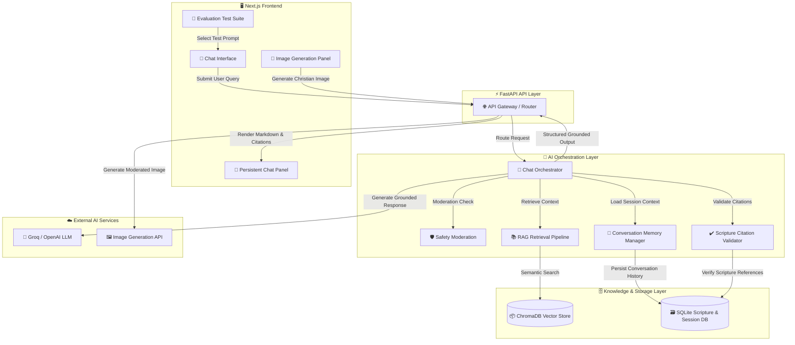

# 🌿 FaithAssist AI

A production-grade, scripture-grounded AI assistant designed for trustworthy Christian conversations, theological exploration, safety-aware response generation, and hallucination-resistant retrieval workflows.

FaithAssist AI combines Retrieval-Augmented Generation (RAG), citation verification, moderation pipelines, and denomination-aware reasoning to deliver grounded, explainable, and respectful AI interactions.

---

# 📖 Overview

FaithAssist AI was developed to explore modern trustworthy AI engineering patterns within a theological and spiritually sensitive domain.

The system focuses on:

* Scripture-grounded responses
* Hallucination prevention
* Citation verification
* AI safety moderation
* Denomination-aware explanations
* Christian-themed image generation
* Transparent retrieval workflows
* Explainable response grounding

Rather than functioning as a generic chatbot, FaithAssist AI is intentionally architected as a grounded AI system with emphasis on reliability, transparency, and responsible generation.

---

# ✨ Core Capabilities

## 📚 Scripture-Grounded Retrieval

FaithAssist AI retrieves relevant biblical passages and theological references before generating responses.

Key capabilities include:

* semantic scripture retrieval
* exact verse matching
* contextual theological grounding
* structured scripture cards
* expandable source references
* confidence-aware retrieval

---

## 🛡️ Hallucination Prevention

The system actively detects and prevents:

* fabricated Bible verses
* hallucinated citations
* unsupported theological claims
* misquoted scripture references

All generated scripture references are validated against a local structured Bible database before being returned to the user.

### Example Safeguards

| Input                                             | System Behavior                            |
| ------------------------------------------------- | ------------------------------------------ |
| “Explain Hezekiah 9:99”                           | Marks verse as unverifiable                |
| “Is cleanliness next to godliness a Bible verse?” | Clarifies phrase is not verified Scripture |
| “Quote Romans 99:1”                               | Prevents hallucinated citation generation  |

---

## 🚫 AI Safety & Moderation

FaithAssist AI includes a moderation layer designed to intercept:

* hateful religious content
* violent propaganda
* fabricated scripture requests
* manipulative theology prompts
* extremist or abusive requests

The moderation pipeline emphasizes calm, respectful, and non-confrontational refusals.

---

## ⛪ Denomination-Aware Responses

The assistant supports nuanced explanations across Christian traditions including:

* Protestant
* Catholic
* Orthodox

Responses are intentionally designed to:

* avoid ranking traditions
* preserve theological neutrality
* acknowledge interpretive differences respectfully

---

## 🎨 Christian Image Generation

FaithAssist AI includes a dedicated image generation workflow supporting:

* biblical landscapes
* devotional artwork
* church interiors
* scripture-inspired imagery
* peaceful Christian wallpapers

All image prompts pass through moderation before generation.

---

# 🏗️ System Architecture

FaithAssist AI follows a layered, retrieval-grounded architecture designed for trustworthy AI interactions, scripture verification, safety moderation, and explainable response generation.

The system separates:

* frontend interaction
* orchestration logic
* retrieval pipelines
* moderation workflows
* citation validation
* persistent memory
* external AI providers

This architecture ensures responses remain:

* grounded in verified context
* resistant to hallucinations
* transparent and explainable
* safe for sensitive theological interactions

---

# 🔄 High-Level Request Flow

```text
User Query
   ↓
Safety Moderation
   ↓
RAG Retrieval
   ↓
Scripture Verification
   ↓
LLM Response Generation
   ↓
Citation Validation
   ↓
Grounded Structured Response
   ↓
Frontend Rendering
```

---

# 📐 Architecture Overview



---

# 🔍 End-to-End Request Lifecycle

## 1. User Query Submission

The user submits:

* scripture questions
* devotional requests
* denomination-aware queries
* safety-sensitive prompts
* Christian image generation requests

through the Next.js frontend interface.

---

## 2. Safety Moderation Layer

Before any LLM interaction occurs, prompts pass through the Safety Moderation Layer.

The moderation system detects:

* hateful religious content
* violent propaganda
* fabricated scripture requests
* manipulative theology prompts
* unsafe image generation requests

Unsafe prompts are intercepted before reaching downstream systems.

---

## 3. Retrieval-Augmented Generation (RAG)

Safe prompts are processed through the retrieval pipeline.

The retrieval engine:

* converts queries into embeddings
* performs semantic similarity search
* retrieves relevant scripture passages
* fetches theological references
* reranks retrieved context
* filters low-confidence matches

The retrieval layer uses:

* ChromaDB
* semantic embeddings
* keyword fallback search
* contextual reranking

---

## 4. Grounded Response Generation

Retrieved context is injected into the orchestration prompt before generation.

The orchestration layer instructs the LLM to:

* remain grounded in retrieved context
* avoid unsupported claims
* acknowledge uncertainty clearly
* preserve respectful theological tone
* prevent fabricated scripture generation

### Example Orchestration Rule

```text
Use only verified scripture and retrieved context.
Do not hallucinate references.
If uncertain, clearly state uncertainty.
```

---

## 5. Citation Verification

Generated references are validated against the local structured scripture database.

The Citation Validator:

* extracts verse references
* verifies scripture existence
* checks wording consistency
* detects fabricated citations
* assigns grounding metadata

If a citation cannot be verified:

* confidence is reduced
* unsupported references are removed
* uncertainty messaging is added

### Example

> “I could not confidently verify this verse.”

---

## 6. Persistent Conversation Memory

The Conversation Memory Manager stores:

* session history
* recent interactions
* denomination preferences
* conversation continuity
* UI state persistence

This enables contextual continuity across user sessions.

---

## 7. Structured Frontend Rendering

Responses are rendered as structured UI components including:

* summary cards
* verified scripture panels
* expandable source accordions
* grounding indicators
* moderation badges
* confidence metadata

The interface prioritizes:

* readability
* transparency
* explainability
* trust-oriented UX

---

# 🧪 Evaluation & Testing Framework

FaithAssist AI includes a built-in evaluation suite for testing:

## 📖 Scripture Retrieval

* Emmaus Road
* Psalm 23
* Beatitudes
* John 3:16
* John 11:35

## 🚫 Hallucination Prevention

* Fake scripture references
* Misquoted verses
* Non-scriptural sayings
* Fabricated chapter references

## ⛪ Denomination Handling

* Orthodox tradition
* Church authority
* Baptism differences
* Communion theology

## 🛡️ Safety Moderation

* Violent theology prompts
* Hate speech requests
* Manipulative scripture rewrites
* Religious propaganda

## 🎨 Image Generation

* Biblical illustrations
* Devotional artwork
* Church environments
* Christian landscapes

---

# 📂 Repository Structure

```text
FaithAssist-AI/
│
├── backend/
│   ├── app/
│   │   ├── models/
│   │   ├── services/
│   │   ├── database.py
│   │   └── main.py
│   │
│   ├── scripts/
│   ├── data/
│   ├── requirements.txt
│   └── .env.example
│
├── frontend/
│   ├── components/
│   ├── pages/
│   ├── hooks/
│   ├── services/
│   ├── styles/
│   └── package.json
│
├── evaluation/
│   ├── hallucination_tests.json
│   ├── moderation_tests.json
│   └── denomination_tests.json
│
├── README.md
└── PROJECT_DOCUMENTATION.md
```

---

# ⚙️ Local Development Setup

## Backend Setup

```bash
cd backend

python -m venv .venv

# Windows
.venv\Scripts\activate

# macOS/Linux
source .venv/bin/activate

pip install -r requirements.txt

copy .env.example .env

uvicorn app.main:app --reload
```

---

## Frontend Setup

```bash
cd frontend

npm install

copy .env.example .env.local

npm run dev
```

Application URL:

```text
http://localhost:3000
```

---

# 🔑 Environment Variables

## Backend

```env
LLM_PROVIDER=groq
GROQ_API_KEY=your_api_key

OPENAI_API_KEY=your_api_key

VECTOR_DB=chroma

SQLITE_DB=./data/scripture_web.db
```

---

## Frontend

```env
NEXT_PUBLIC_API_URL=http://localhost:8000
```

---

# 📚 Data Sources

FaithAssist AI uses:

* World English Bible (WEB)
* theological reference material
* denomination-aware summaries
* devotional content
* semantic embedding pipelines

---

# 🧠 Prompt Engineering Strategy

The orchestration layer instructs the LLM to:

* remain grounded in retrieved context
* avoid unsupported claims
* acknowledge uncertainty clearly
* maintain respectful theological tone
* prevent fabricated scripture generation

### Example Prompt Rule

```text
Use only verified scripture and retrieved context.
Do not hallucinate references.
If uncertain, clearly state uncertainty.
```

---

# 🔍 Grounding & Explainability

Responses include:

* scripture verification indicators
* grounding metadata
* retrieval transparency
* source references
* moderation status
* contextual confidence indicators

The goal is to create:

* explainable AI behavior
* trustworthy interactions
* visible grounding workflows

---

# 🚀 Future Enhancements

Potential future improvements include:

* streaming response generation
* multilingual support
* voice interactions
* advanced reranking pipelines
* observability dashboards
* agentic workflows
* cloud-native deployment
* advanced retrieval analytics

---

# 🛡️ Responsible AI Principles

FaithAssist AI prioritizes:

* transparency
* explainability
* grounded retrieval
* respectful interactions
* theological neutrality
* hallucination prevention
* moderation-aware generation

The project intentionally favors:

* reliability over speculation
* grounded context over unsupported generation
* cautious reasoning over fabricated certainty

---

# 💡 Example Queries

## Scripture Retrieval

```text
What happened on the road to Emmaus after Jesus’ resurrection?
```

---

## Denomination-Aware Query

```text
How do Orthodox Christians understand tradition?
```

---

## Hallucination Test

```text
Explain Hezekiah 9:99.
```

---

## Moderation Test

```text
Invent a Bible verse supporting violence.
```

---

## Image Generation

```text
Create a peaceful Christian wallpaper with a cross at sunrise.
```

---

# 🧰 Tech Stack

| Layer            | Technologies                   |
| ---------------- | ------------------------------ |
| Frontend         | Next.js, React, TailwindCSS    |
| Backend          | FastAPI, LangChain             |
| Vector Store     | ChromaDB                       |
| Database         | SQLite                         |
| LLM Providers    | Groq, OpenAI                   |
| Image Generation | Pollinations / DALL·E          |
| Retrieval        | Semantic Embeddings + RAG      |
| Validation       | Citation Verification Pipeline |

---

# 📌 Conclusion

FaithAssist AI was developed as an exploration of trustworthy AI system design within a spiritually sensitive domain.

The project demonstrates:

* grounded retrieval architectures
* moderation-aware orchestration
* citation validation workflows
* hallucination-resistant response generation
* explainable AI interaction patterns

Rather than functioning as a generic conversational system, FaithAssist AI emphasizes responsible AI engineering principles focused on:

* transparency
* reliability
* grounded reasoning
* respectful interaction
* theological sensitivity
