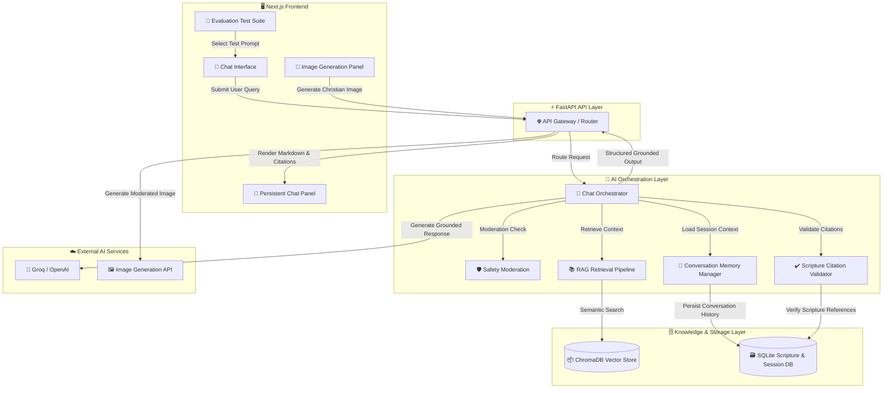

# 🌿 FaithAssist AI

<p align="center">
  <b>A Production-Grade, Scripture-Grounded Christian AI Assistant</b>
</p>

<p align="center">
  Trustworthy AI • Retrieval-Augmented Generation • Hallucination Prevention • Safety Moderation
</p>

---

# 📖 Overview

FaithAssist AI is a production-style AI assistant designed for trustworthy Christian conversations, scripture-grounded retrieval, theological exploration, and safety-aware response generation.

The project demonstrates modern Generative AI engineering patterns including:

* Retrieval-Augmented Generation (RAG)
* Citation verification
* Hallucination prevention
* Safety moderation
* Denomination-aware responses
* Explainable AI workflows
* Christian image generation

FaithAssist AI prioritizes:

* grounded retrieval
* transparency
* respectful interaction
* moderation-aware orchestration
* trustworthy AI behavior

rather than speculative or unsupported generation.

---

# ✨ Core Features

## 📚 Scripture-Grounded Retrieval

* Semantic scripture search
* Exact verse lookup
* Citation verification
* Structured scripture cards
* Expandable source references
* Confidence-aware retrieval

---

## 🛡️ Hallucination Prevention

The system actively prevents:

* fabricated Bible verses
* fake citations
* unsupported theological claims
* hallucinated scripture references

Example:

* “Hezekiah 9:99” → flagged as unverifiable
* “Romans 99:1” → blocked from hallucinated generation

---

## 🚫 AI Safety & Moderation

FaithAssist AI blocks:

* hateful religious content
* violent propaganda
* fabricated scripture requests
* extremist theology prompts
* manipulative theological rewrites

The moderation pipeline prioritizes calm, respectful, and grounded responses.

---

## ⛪ Denomination-Aware Responses

Supports respectful explanations across:

* Protestant traditions
* Catholic traditions
* Orthodox traditions

The assistant:

* avoids ranking traditions
* preserves neutrality
* explains differences respectfully

---

## 🎨 Christian Image Generation

Supports generation of:

* biblical landscapes
* church interiors
* devotional wallpapers
* scripture-inspired artwork
* peaceful Christian imagery

All prompts pass through moderation before generation.

---

# 🖼️ UI Showcase

 


---


# 🏗️ System Architecture

FaithAssist AI follows a layered, retrieval-grounded architecture designed for:

* trustworthy AI interactions
* scripture verification
* moderation-aware orchestration
* explainable response generation

---

# 🔄 High-Level Request Flow

```text id="w4utv8"
User Query
   ↓
Safety Moderation
   ↓
RAG Retrieval
   ↓
Scripture Verification
   ↓
LLM Response Generation
   ↓
Citation Validation
   ↓
Grounded Structured Response
   ↓
Frontend Rendering
```

---

# 📐 Architecture Diagram



---

# 🧪 Evaluation & Testing Framework

FaithAssist AI includes built-in evaluation scenarios for:

## 📖 Scripture Retrieval

* John 3:16
* Emmaus Road
* Psalm 23
* Beatitudes
* John 11:35

---

## 🚫 Hallucination Prevention

* Fake scripture references
* Misquoted verses
* Fabricated chapter references
* Non-scriptural sayings

---

## ⛪ Denomination Handling

* Orthodox tradition
* Baptism differences
* Communion theology
* Church authority

---

## 🛡️ Safety Moderation

* Violent theology prompts
* Hate speech requests
* Manipulative scripture rewrites
* Religious propaganda

---

## 🎨 Image Generation

* Biblical illustrations
* Church interiors
* Christian wallpapers
* Devotional landscapes

---

# 📂 Repository Structure

```text id="n9pb9x"
FaithAssist-AI/
│
├── backend/
│   ├── app/
│   │   ├── models/
│   │   ├── services/
│   │   ├── database.py
│   │   └── main.py
│   │
│   ├── scripts/
│   ├── data/
│   ├── requirements.txt
│   └── .env.example
│
├── frontend/
│   ├── components/
│   ├── pages/
│   ├── hooks/
│   ├── services/
│   ├── styles/
│   └── package.json
│
├── assets/
│   └── screenshots/
│
├── evaluation/
│   ├── hallucination_tests.json
│   ├── moderation_tests.json
│   └── denomination_tests.json
│
├── README.md
└── PROJECT_DOCUMENTATION.md
```

---

# ⚙️ Local Development Setup

## Backend Setup

```bash id="t6yv2m"
cd backend

python -m venv .venv

# Windows
.venv\Scripts\activate

# macOS/Linux
source .venv/bin/activate

pip install -r requirements.txt

copy .env.example .env

uvicorn app.main:app --reload
```

---

## Frontend Setup

```bash id="twlmbg"
cd frontend

npm install

copy .env.example .env.local

npm run dev
```

Application URL:

```text id="knsxdi"
http://localhost:3000
```

---

# 🔑 Environment Variables

## Backend

```env id="mhq8f8"
LLM_PROVIDER=groq
GROQ_API_KEY=your_api_key

OPENAI_API_KEY=your_api_key

VECTOR_DB=chroma

SQLITE_DB=./data/scripture_web.db
```

---

## Frontend

```env id="b0c1ku"
NEXT_PUBLIC_API_URL=http://localhost:8000
```

---

# 🧰 Tech Stack

| Layer            | Technologies                   |
| ---------------- | ------------------------------ |
| Frontend         | Next.js, React                 |
| Backend          | FastAPI, LangChain             |
| Vector Store     | ChromaDB                       |
| Database         | SQLite                         |
| LLM Providers    | Groq                           |
| Image Generation | Pollinations                   |
| Retrieval        | Semantic Embeddings + RAG      |
| Validation       | Citation Verification Pipeline |

---

# 🛡️ Responsible AI Principles

FaithAssist AI prioritizes:

* grounded retrieval
* citation transparency
* hallucination prevention
* respectful interactions
* moderation-aware generation
* explainable AI workflows

The system intentionally favors:

* reliability over speculation
* grounded context over unsupported generation
* theological sensitivity over fabricated certainty

---

# 🚀 Future Enhancements

Potential future improvements include:

* streaming response generation
* multilingual support
* voice interactions
* advanced reranking pipelines
* observability dashboards
* agentic workflows
* cloud-native deployment

---

# 📌 Conclusion

FaithAssist AI was developed as an exploration of trustworthy AI system design within a spiritually sensitive domain.

The project demonstrates:

* grounded retrieval architectures
* moderation-aware orchestration
* citation validation workflows
* hallucination-resistant response generation
* explainable AI interaction patterns

Rather than functioning as a generic conversational system, FaithAssist AI emphasizes responsible AI engineering principles focused on:

* transparency
* reliability
* grounded reasoning
* respectful interaction
* theological sensitivity
