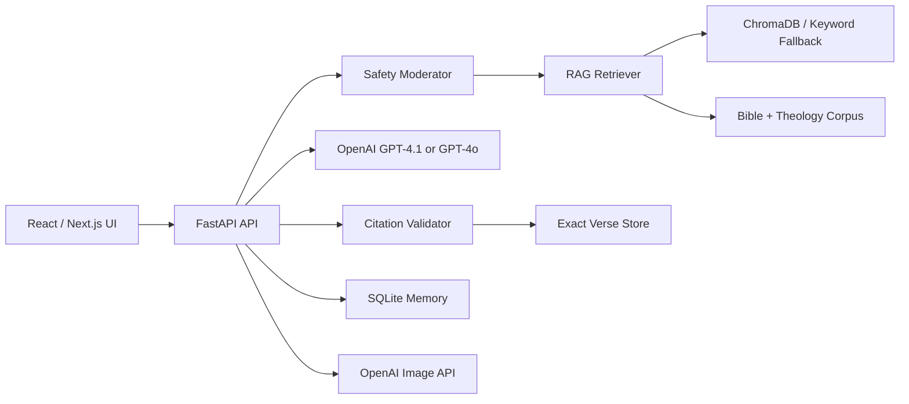

# FaithAssist AI Architecture

FaithAssist AI is organized as a React frontend plus a FastAPI backend. The backend owns AI orchestration, retrieval, moderation, citation validation, image generation, and SQLite memory.

## Grounding Workflow

1. The user message is moderated before model use.
2. The retriever searches scripture and theology documents.
3. The LLM receives only verified context and a strict prompt.
4. Any scripture reference in the answer is checked against retrieved citations.
5. Unsupported references trigger a repair pass.
6. If support is still missing, the assistant states that the verse could not be confidently verified.

## Safety Workflow

The deterministic moderator blocks fabricated scripture, hateful sermons, violent religious propaganda, and jailbreak attempts before an LLM call. Production usage should add OpenAI Moderation, audit logs, and human review for policy tuning.

## Memory

SQLite stores recent messages, denomination preference, topic hints, and a lightweight rolling summary. The summary is injected into future chat prompts to improve continuity without storing long raw histories in every prompt.
